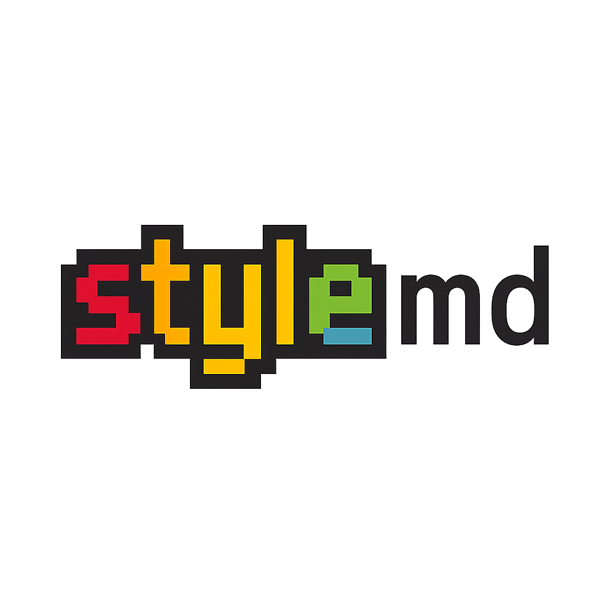
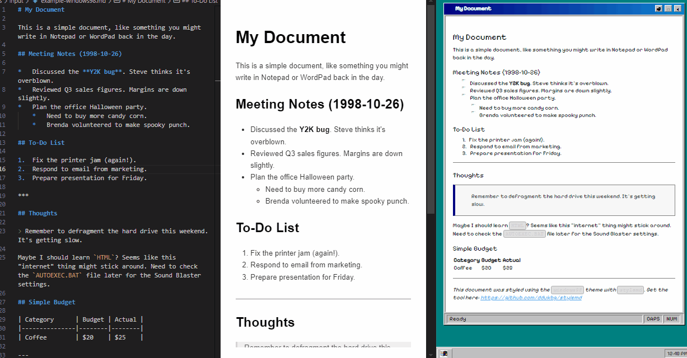

# stylemd

<!-- Logo Placeholder -->
<p align="center">
  
</p>

A command-line tool to generate static HTML pages from Markdown files, applying various style themes.

<!-- Core Functionality Visual Placeholder -->
<p align="center">
    
    
    
</p>

[](https://www.npmjs.com/package/@ddukbg/stylemd) <!-- Placeholder: Replace with actual badge if published -->
[](https://opensource.org/licenses/MIT) <!-- Assuming MIT License -->

## Features

*   Convert Markdown files to HTML with stylish themes
*   Create complete static blog sites with all themes
*   Simple command-line interface for both single files and blogs
*   Multiple pre-built retro and modern themes
*   Configurable blog settings with front-matter support
*   Automatic index and navigation generation for blogs
*   Custom CSS and locale settings
*   LaTeX math equation support (inline and display formats)

## Installation

There are two ways to install `stylemd`:

### 1. Global Installation (Recommended for general use)

If you want to use `stylemd` as a command-line tool anywhere on your system, install it globally via npm:

```bash
npm install -g @ddukbg/stylemd
```

Make sure you have Node.js and npm installed.

### 2. Local Development Setup

If you want to contribute to the project or modify the code:

1.  **Clone the repository:**
    ```bash
    git clone https://github.com/ddukbg/stylemd.git # Replace with your actual repo URL if different
    cd stylemd
    ```
2.  **Install dependencies:**
    ```bash
    npm install
    ```
3.  **Link the package:** This allows you to run the `stylemd` command locally using the cloned code.
    ```bash
    npm link
    ```
    Now you can run `stylemd` from any directory, and it will use the code in your cloned `stylemd` folder.

## Usage

StyleMD supports two main modes: single file conversion and blog mode.

### Single File Mode

Convert a single Markdown file to a styled HTML page:

```bash
stylemd <markdownFile> [options]
```

**Arguments:**

*   `<markdownFile>`: Path to the input Markdown file (e.g., `notes.md`, `examples/input/example-default.md`).

**Options:**

*   `-t, --template <name>`: Template name to use (default: `default`). See available themes above.
*   `-o, --output <file>`: Output HTML file path (default: `index.html`).
*   `-h, --help`: Display help for command.
*   `-V, --version`: Output the version number.

**Examples:**

```bash
# Use the 'windows98' theme for 'mydoc.md' and output to 'mypage.html'
stylemd mydoc.md -t windows98 -o mypage.html

# Use the 'terminal' theme for an example file, output to the root
stylemd examples/input/example-terminal.md --template terminal --output example-output-terminal.html

# Use the default theme and output to 'index.html'
stylemd README.md
```

### Blog Mode

Create and build a complete static blog site using any theme:

#### 1. Initialize a new blog

```bash
stylemd blog init <siteDir> [-T <template>]
```

This creates a directory structure with everything needed for your blog:

```
<siteDir>/
├── content/           # Your blog posts as Markdown files
├── pages/             # Static pages (about, contact, etc.)
├── public/            # Output directory (generated HTML)
├── templates/         # Theme templates
│   └── <theme>/       # Selected theme (e.g., windows98)
│       ├── post.hbs   # Post template (from original theme)
│       ├── page.hbs   # Page template (from original theme)
│       └── index.hbs  # Blog index template (includes post list)
└── stylemd.config.json  # Blog configuration
```

Example:
```bash
stylemd blog init my-retro-blog -T windows98
```

#### 2. Add content

Create Markdown files in the appropriate directories:

* **Blog posts**: Add `.md` files to the `content/` directory
* **Static pages**: Add `.md` files to the `pages/` directory

Each file can include front-matter at the top:

```markdown
---
title: My First Blog Post
date: 2025-05-01
slug: first-post
draft: false
---

# This is my first post

Content goes here...
```

#### 3. Configure your blog

Edit `stylemd.config.json` to customize your blog settings:

```json
{
  "siteTitle": "My Retro Blog",
  "siteDescription": "A blog about retro computing",
  "theme": "windows98",
  "postsDir": "content",
  "pagesDir": "pages",
  "outputDir": "public",
  "dateFormat": "YYYY-MM-DD",
  "timeFormat": "HH:mm",
  "locale": "en-US",
  "pagination": {
    "enabled": true,
    "perPage": 5
  },
  "sortOrder": "newest-first",
  "showDrafts": false,
  "flatPosts": true,
  "flatPages": true,
  "author": {
    "name": "Your Name",
    "email": "your.email@example.com",
    "avatar": "https://example.com/avatar.jpg"
  },
  "navigationLinks": [
    { "title": "About", "url": "about.html" },
    { "title": "Projects", "url": "projects.html" }
  ],
  "socialLinks": [
    { "platform": "GitHub", "url": "https://github.com/yourusername" },
    { "platform": "Twitter", "url": "https://twitter.com/yourusername" }
  ],
  "footerText": "© 2025 My Retro Blog",
  "customCSS": ".my-custom-class { color: red; }"
}
```

Key configuration options include theme selection, URL structure (flat or nested), pagination, author information, and custom CSS.

#### 4. Build your blog

```bash
cd <siteDir>
stylemd blog build
```

This generates your complete site in the `public/` directory, ready for deployment.

You can also specify a custom output directory:

```bash
stylemd blog build --output dist
```

#### 5. Deploy your blog

After building your blog, you can deploy it to any static hosting service:

```bash
# Example: Deploy to GitHub Pages
cp -r public/* docs/
git add docs
git commit -m "Update blog"
git push

# Example: Deploy to Netlify
# Just connect your GitHub repo to Netlify and set the publish directory to 'public'
```

## Available Themes

Here are the currently included themes (each with single page and blog mode support):

1.  **`default`**: Clean, modern baseline style suitable for general documents. [Page Preview](https://stylemd.pages.dev/example-output-default.html) | [Blog Preview](https://stylemd.pages.dev/blog-default/)
2.  **`windows98`**: Mimics the classic Windows 98 UI elements. [Page Preview](https://stylemd.pages.dev/example-output-windows98.html) | [Blog Preview](https://stylemd.pages.dev/blog-windows98/)
3.  **`terminal`**: Simulates an old-school terminal output with prompt and cursor. [Page Preview](https://stylemd.pages.dev/example-output-terminal.html) | [Blog Preview](https://stylemd.pages.dev/blog-terminal/)
4.  **`geocities`**: A nostalgic, chaotic, and fun GeoCities-inspired theme. [Page Preview](https://stylemd.pages.dev/example-output-geocities.html) | [Blog Preview](https://stylemd.pages.dev/blog-geocities/)
5.  **`blueprint`**: Technical blueprint style with grid background and annotations. [Page Preview](https://stylemd.pages.dev/example-output-blueprint.html) | [Blog Preview](https://stylemd.pages.dev/blog-blueprint/)
6.  **`macos-classic`**: Inspired by the look and feel of macOS Classic (System 7/8/9). [Page Preview](https://stylemd.pages.dev/example-output-macos-classic.html) | [Blog Preview](https://stylemd.pages.dev/blog-macos-classic/)
7.  **`amiga-workbench`**: Emulates the Amiga Workbench 1.x interface. [Page Preview](https://stylemd.pages.dev/example-output-amiga-workbench.html) | [Blog Preview](https://stylemd.pages.dev/blog-amiga-workbench/)
8.  **`msdos`**: Text-mode interface resembling MS-DOS prompt and `edit.com`. [Page Preview](https://stylemd.pages.dev/example-output-msdos.html) | [Blog Preview](https://stylemd.pages.dev/blog-msdos/)
9.  **`c64`**: Commodore 64 BASIC screen style with pixel font. [Page Preview](https://stylemd.pages.dev/example-output-c64.html) | [Blog Preview](https://stylemd.pages.dev/blog-c64/)
10. **`vim`**: Minimalist theme inspired by the Vim editor (Solarized Dark). [Page Preview](https://stylemd.pages.dev/example-output-vim.html) | [Blog Preview](https://stylemd.pages.dev/blog-vim/)
11. **`retro-console`**: Monochrome retro game console/HUD interface (like Fallout's Pip-Boy). [Page Preview](https://stylemd.pages.dev/example-output-retro-console.html) | [Blog Preview](https://stylemd.pages.dev/blog-retro-console/)
12. **`pixel-art`**: Retro RPG style with pixel font and UI window elements. [Page Preview](https://stylemd.pages.dev/example-output-pixel-art.html) | [Blog Preview](https://stylemd.pages.dev/blog-pixel-art/)
13. **`y2k`**: Early 2000s web design aesthetic with Aqua elements. [Page Preview](https://stylemd.pages.dev/example-output-y2k.html) | [Blog Preview](https://stylemd.pages.dev/blog-y2k/)
14. **`frutiger-aero`**: Mid-2000s style with glossy, glassy, and nature-inspired elements. [Page Preview](https://stylemd.pages.dev/example-output-frutiger-aero.html) | [Blog Preview](https://stylemd.pages.dev/blog-frutiger-aero/)
15. **`area51`**: Dark, retro sci-fi/hacker theme with neon green text. [Page Preview](https://stylemd.pages.dev/example-output-area51.html) | [Blog Preview](https://stylemd.pages.dev/blog-area51/)
16. **`heartland`**: Warm, cozy theme inspired by 90s personal/hobby sites. [Page Preview](https://stylemd.pages.dev/example-output-heartland.html) | [Blog Preview](https://stylemd.pages.dev/blog-heartland/)
17. **`hollywood`**: Flashy 90s entertainment/fan site theme with gold and purple. [Page Preview](https://stylemd.pages.dev/example-output-hollywood.html) | [Blog Preview](https://stylemd.pages.dev/blog-hollywood/)
18. **`atlantis`**: Mystical, dark fantasy theme inspired by sunken cities. [Page Preview](https://stylemd.pages.dev/example-output-atlantis.html) | [Blog Preview](https://stylemd.pages.dev/blog-atlantis/)

*(All themes work for both single page conversions and full blog sites.)*

## Project Structure

```
stylemd/
├── bin/                 # CLI script
├── templates/           # Theme templates (.hbs)
├── examples/
│   ├── input/           # Example Markdown files
│   └── output/          # Example generated HTML (Git ignored)
├── node_modules/        # Dependencies (Git ignored)
├── .gitignore           # Files/folders ignored by Git
├── package.json
├── package-lock.json
└── README.md
```

## Custom Templates

Currently, `stylemd` only loads templates from its internal `/templates` directory. Using templates from custom external directories is **not yet supported**.

## Contributing

Contributions are welcome! If you'd like to add new themes, improve existing ones, fix bugs, or add features (like custom template directory support), please follow these steps:

1.  **Fork** the repository.
2.  Create a new **branch** for your feature or fix (`git checkout -b feature/my-new-theme`).
3.  Make your changes. Ensure new themes are added as `.hbs` files in the `templates` directory and consider adding a corresponding example `.md` file in `examples/input`.
4.  Test your changes locally.
5.  Commit your changes (`git commit -am 'Add some feature'`).
6.  Push to the branch (`git push origin feature/my-new-theme`).
7.  Create a new **Pull Request**.

## Future Plans (Roadmap)

Here are some features planned for future releases:

*   **Custom Template Directory:** Support for loading themes from a user-specified directory (`--template-dir` option). This will allow users to easily create and use their own themes without modifying the core package.
*   **Watch Mode:** A `--watch` flag to automatically re-generate the HTML file when the source Markdown file is modified, providing a live preview experience during editing.
*   **Directory Conversion:** Ability to process an entire directory of Markdown files at once, converting each `.md` file into a corresponding HTML file, potentially mirroring the input directory structure.

Contributions towards these features are welcome!

## License

This project is licensed under the **MIT License**. See the [LICENSE](LICENSE) file for details.

## Additional Features

### LaTeX Math Equations

StyleMD supports rendering LaTeX math equations using MathJax:

**Inline equations** can be written with single dollar signs: `$E = mc^2$` renders as $E = mc^2$

**Display equations** can be written with double dollar signs:
```
$$ \frac{d}{dx}(x^n) = nx^{n-1} $$
```

Renders as:
$$ \frac{d}{dx}(x^n) = nx^{n-1} $$

You can use all standard LaTeX math syntax in both single file mode and blog mode. 