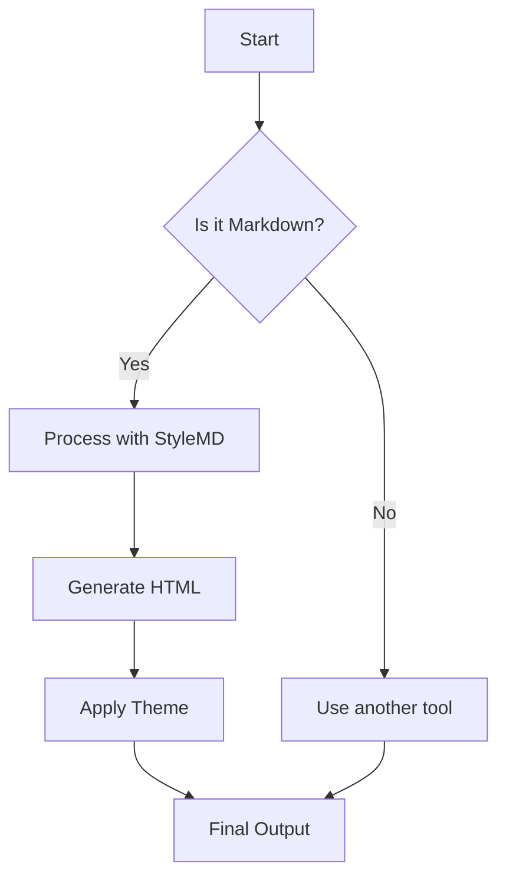
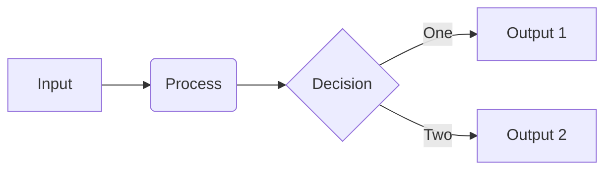
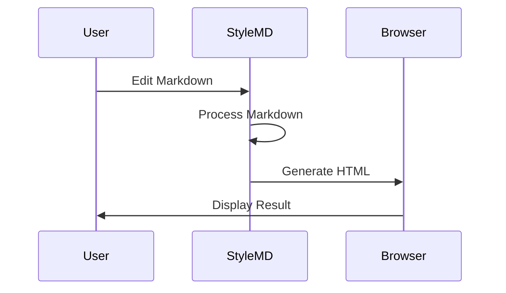

# Markdown Sample Post

This post demonstrates various Markdown elements and features supported by StyleMD.

## 1. Text Formatting

Regular text with **bold text**, *italic text*, and ~~strikethrough~~.

> This is a blockquote. It's used for emphasizing important content.
> 
> It can also span multiple paragraphs.

## 2. Lists

### Unordered List:

* Item 1
* Item 2
  * Nested item 2.1
  * Nested item 2.2
* Item 3

### Ordered List:

1. First item
2. Second item
3. Third item

## 3. Code

Inline code: `console.log('Hello, World!')`

Code block:

```javascript
function greet(name) {
  return `Hello, ${name}!`;
}

console.log(greet('World'));
```

## 4. Links and Images

[StyleMD GitHub Page](https://github.com/ddukbg/stylemd)


## 5. Tables

| Name | Age | Profession |
|------|-----|------------|
| John Doe | 30 | Developer |
| Jane Smith | 25 | Designer |
| Emily Johnson | 28 | Marketer |

## 6. Horizontal Rule

Below is a horizontal rule:

---

## 7. Task Lists

- [x] Completed task
- [ ] Incomplete task
- [x] Another completed task

## 8. Footnotes

This has a footnote[^1].

[^1]: This is the footnote content.

## 9. Definition List

StyleMD
: A tool that converts Markdown files to HTML with various styles

Markdown
: A lightweight markup language with plain-text formatting syntax

## 10. Mermaid Diagrams

StyleMD also supports Mermaid diagrams:



Flowchart example:



Sequence diagram:



## 11. Mathematical Formulas

Some math expressions: $E = mc^2$

$$
\frac{d}{dx}(x^n) = nx^{n-1}
$$