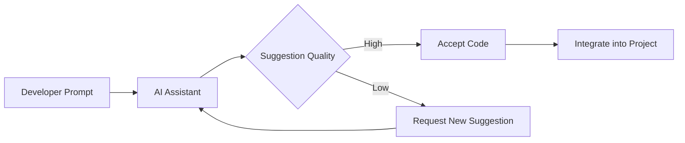
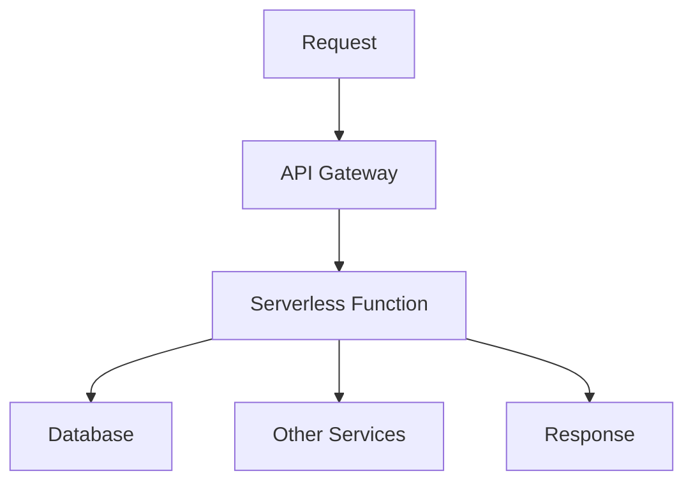
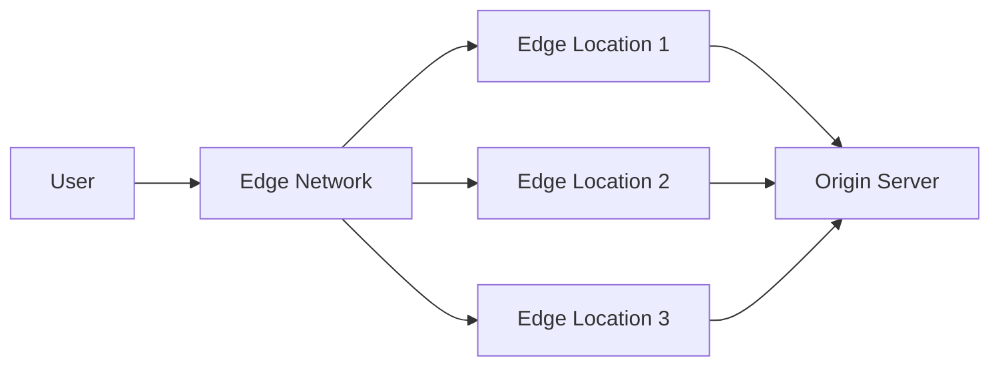

# Web Development Trends 2025

Several technologies and methodologies are gaining attention in the web development field in 2025. This post explores the current web development trends.

## 1. Growth of WebAssembly

WebAssembly (WASM) continues to grow, with many companies and developers now using it to build high-performance web applications.

```rust
// Rust example for WebAssembly
fn fibonacci(n: i32) -> i32 {
    match n {
        0 => 0,
        1 => 1,
        _ => fibonacci(n - 1) + fibonacci(n - 2),
    }
}
```

## 2. AI-Powered Development Tools

AI tools that help with code generation and refactoring have become commonplace. Tools like GitHub Copilot are now standard parts of development environments.

> Research shows that using AI code assistants can improve development speed by approximately 55%.



## 3. Serverless Architecture

Serverless computing continues to gain popularity, allowing developers to focus on business logic rather than infrastructure management.

### Major Serverless Providers:

- AWS Lambda
- Azure Functions
- Google Cloud Functions
- Cloudflare Workers



## 4. Micro Frontends

Micro frontend architecture is an approach to breaking up large frontend applications into smaller, independent parts.


## 5. Developer Experience (DX) Focused Design

As interest in developer experience (DX) increases, development workflows and tool usability have greatly improved.

| Tool | Key Features | Languages Used |
|------|-------------|----------------|
| Vite | Fast build, HMR | JavaScript, TypeScript |
| Next.js | Server-side rendering, static site generation | React |
| SvelteKit | File-based routing, server rendering | Svelte |

## 6. Edge Computing

Edge computing brings computation and data storage closer to the sources of data, improving response times and saving bandwidth.



## 7. Web Components & Custom Elements

Web Components continue to gain adoption as developers seek more interoperable and reusable UI elements.

```javascript
class HelloWorld extends HTMLElement {
  connectedCallback() {
    this.innerHTML = `<h1>Hello, World!</h1>`;
  }
}
customElements.define('hello-world', HelloWorld);
```

## 8. Performance Metrics & Core Web Vitals

Google's Core Web Vitals have become essential metrics for web developers to optimize for.


## Conclusion

Web development continues to evolve, and keeping up with these trends is essential for modern web developers. Continuous learning and experimentation are important to become familiar with the latest technologies.