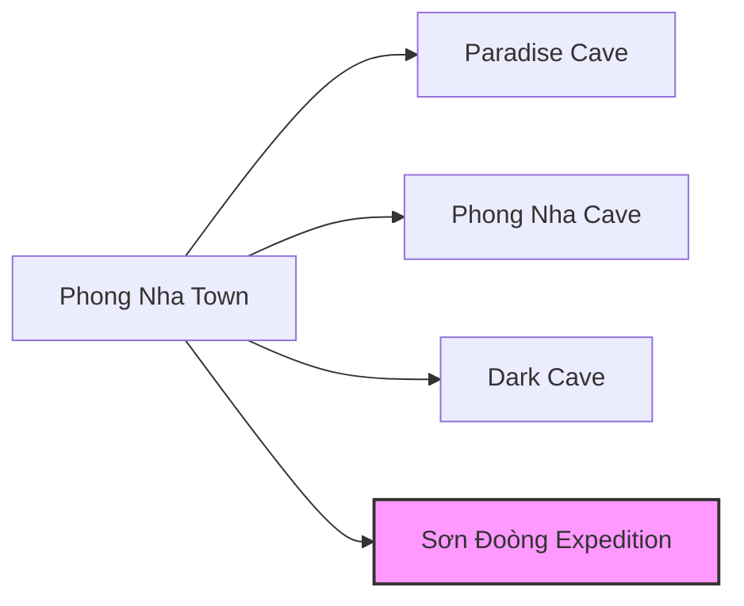
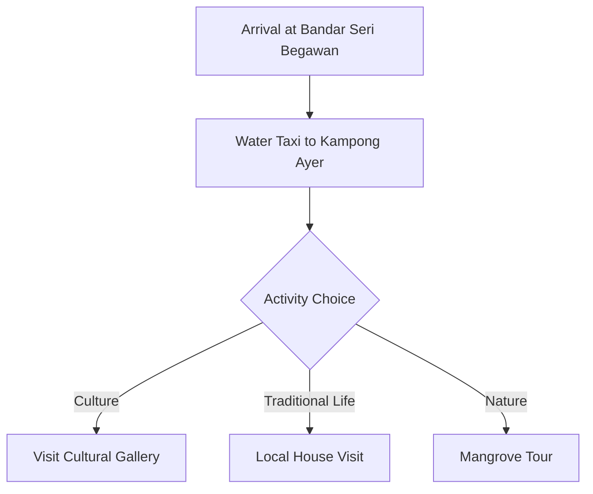

# Exploring Hidden Gems of Southeast Asia

Southeast Asia offers a wealth of experiences beyond the well-trodden tourist paths. This post uncovers some of the region's most enchanting hidden gems.

## 1. The Ancient Village of Ban Chiang, Thailand

Ban Chiang is a UNESCO World Heritage site known for its archaeological discoveries. The area reveals ancient pottery and bronze artifacts dating back over 5,000 years.

> The quiet village atmosphere and the extraordinary museum make Ban Chiang a perfect escape from Thailand's busy tourist centers.

## 2. Phong Nha-Kẻ Bàng National Park, Vietnam

Home to some of the world's largest and most spectacular caves, this national park offers breathtaking landscapes and underground rivers.

### Notable Caves:

1. Sơn Đoòng Cave (world's largest cave)
2. Paradise Cave
3. Phong Nha Cave

## 3. Mrauk U, Myanmar

Once a powerful kingdom, Mrauk U is now a mesmerizing archaeological site with hundreds of temples and pagodas scattered across the hills.

## 4. Baliem Valley, Indonesia

Tucked away in Papua's highlands, the Baliem Valley offers extraordinary landscapes and the opportunity to meet indigenous Dani people.

| Season | Weather | Recommendation |
|--------|---------|----------------|
| June-August | Dry and cool | Ideal for trekking |
| September-May | Variable rain | Less crowded, lush scenery |

## 5. Kampong Ayer, Brunei

Known as the "Venice of the East," this water village consists of houses built on stilts connected by wooden walkways.

## 6. Plain of Jars, Laos

This mysterious archaeological landscape contains thousands of stone jars scattered across the Xieng Khouang Plateau.

## 7. Travel Tips for Hidden Destinations

- [x] Research local customs before visiting
- [x] Learn basic local phrases
- [ ] Consider hiring local guides
- [x] Pack appropriately for rural conditions
- [ ] Allow extra time for transportation delays

## 8. Responsible Tourism

When visiting these lesser-known destinations, responsible tourism practices are especially important:

1. Support local businesses
2. Minimize environmental impact
3. Respect cultural sites and traditions
4. Engage meaningfully with local communities

## Further Planning Resources

StyleMD Travel Planner[^1] can help with organizing trips to these destinations.

[^1]: Fictional service used for demonstration purposes.

Happy exploring!