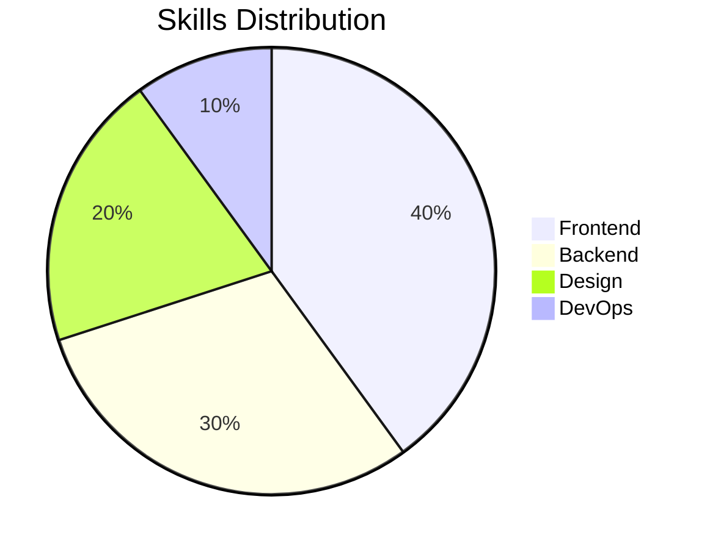

# About Me

## Who Am I?

I'm a passionate web developer and designer who enjoys creating digital experiences that are both functional and aesthetically pleasing. With a background in computer science and a love for creativity, I bridge the gap between technical and visual aspects of web development.

## My Skills

## Experience

I've worked with a variety of technologies and frameworks, focusing primarily on:

- React and Vue.js for frontend development
- Node.js and Python for backend services
- UI/UX design principles
- Technical writing and documentation

## Get In Touch

Feel free to reach out to me through any of the social media links in the footer. I'm always open to interesting projects and collaborations!