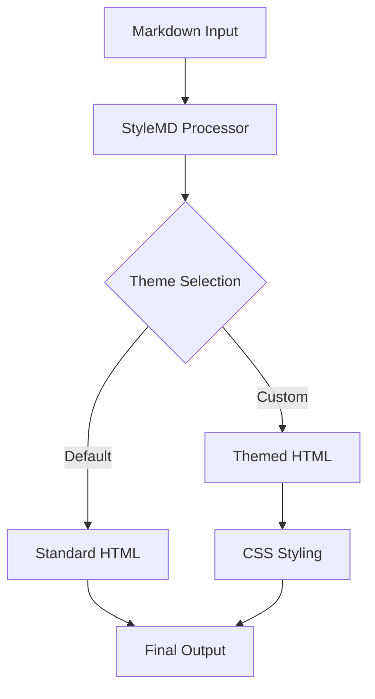
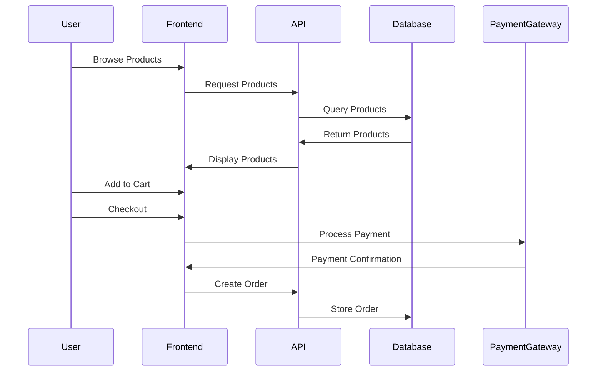

# My Projects

Here's a collection of projects I've worked on recently. Each demonstrates different aspects of my skills and interests in web development and design.

## StyleMD Theme Creator

A tool for creating custom themes for StyleMD markdown-to-HTML converter.

**Technologies:** JavaScript, Handlebars, CSS
**GitHub:** [View Project](#)

## Personal Portfolio Website

A responsive portfolio website showcasing my work and skills.

**Technologies:** HTML, CSS, JavaScript
**Live Demo:** [View Website](#)

## Weather Dashboard App

A web application that provides real-time weather information for locations worldwide.

| Feature | Description |
|---------|-------------|
| Current Conditions | Real-time weather data |
| 5-Day Forecast | Extended weather prediction |
| Location Search | Search for any city globally |
| Weather Maps | Interactive weather maps |

**Technologies:** React, OpenWeather API, Leaflet.js
**GitHub:** [View Project](#)

## E-commerce Platform

A full-stack e-commerce solution with product management, shopping cart, and payment processing.

**Technologies:** Node.js, Express, MongoDB, Stripe, React
**GitHub:** [View Project](#)